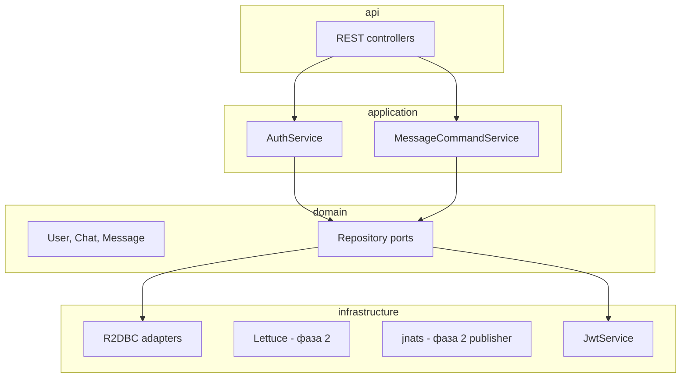

# Архитектура private-chat

Краткий навигатор по бэкенду. Подробный план: [docs/PLAN.md](docs/PLAN.md).

## Слои



| Пакет | Назначение |
|-------|------------|
| `chat.privatechat.api` | HTTP DTO, `@RestController`, обработка ошибок |
| `chat.privatechat.application` | Use-cases: auth, чаты, сообщения |
| `chat.privatechat.domain` | Модели и порты (без Spring) |
| `chat.privatechat.infrastructure` | R2DBC, JWT, NATS, UUID |
| `chat.privatechat.config` | Security, beans |

## Write-path (фаза 1)

Прямой `POST /api/v1/chats/{chatId}/messages`:

1. Проверка membership в чате
2. Транзакция: `INSERT messages` + `INSERT outbox`
3. Ответ `202 Accepted`
4. Outbox publisher → NATS — **фаза 2**

## Глоссарий

| Термин | Значение |
|--------|----------|
| `clientMessageId` | UUID клиента для идемпотентности; уникален в рамках чата |
| `revision` | Версия черновика в Redis (фаза 2) |
| `outbox` | Таблица событий в той же TX, что и сообщение; at-least-once доставка |

## Документация в коде

```bash
./gradlew :server:dokkaHtml
# → server/build/dokka/html/index.html
```

KDoc: `domain/` и `application/` — на каждую сущность и use-case.
