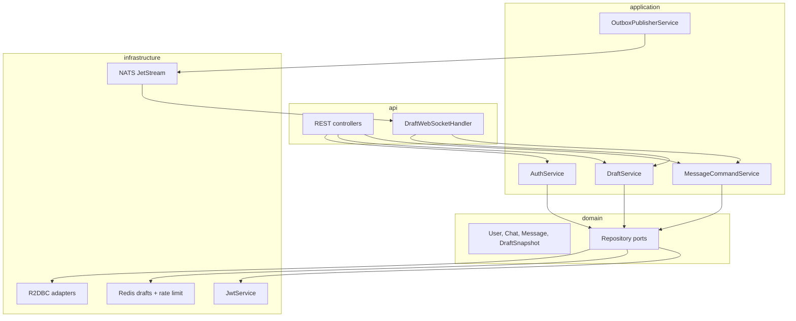

# Архитектура private-chat

Краткий навигатор по бэкенду. Подробный план: [docs/PLAN.md](docs/PLAN.md).

## Слои



| Пакет | Назначение |
|-------|------------|
| `chat.privatechat.api` | HTTP DTO, `@RestController`, WebSocket, обработка ошибок |
| `chat.privatechat.application` | Use-cases: auth, чаты, черновики, сообщения, outbox |
| `chat.privatechat.domain` | Модели и порты (без Spring) |
| `chat.privatechat.infrastructure` | R2DBC, Redis, NATS, JWT, UUID |
| `chat.privatechat.config` | Security, beans, WebSocket mapping |

## Write-path (draft-sync)

WebSocket `/api/v1/ws?token=<JWT>` или REST `/drafts/{id}/commit`:

1. Проверка membership, rate limit, revision черновика
2. Снимок из Redis → транзакция: `INSERT messages` + `INSERT outbox`
3. Удаление черновика в Redis
4. Ответ `message.accepted` (202 / WS frame)
5. Outbox publisher → NATS JetStream `chat.events`
6. NATS subscriber → `message.new` всем онлайн-участникам чата

Прямой `POST /messages` — fallback без черновика (боты, тесты).

## Глоссарий

| Термин | Значение |
|--------|----------|
| `clientMessageId` | UUID клиента для идемпотентности; уникален в рамках чата |
| `revision` | Версия черновика в Redis; last-write-wins |
| `outbox` | Таблица событий в той же TX, что и сообщение; at-least-once доставка |

## Документация в коде

```bash
./gradlew :server:dokkaHtml
# → server/build/dokka/html/index.html
```

KDoc: `domain/` и `application/` — на каждую сущность и use-case.
