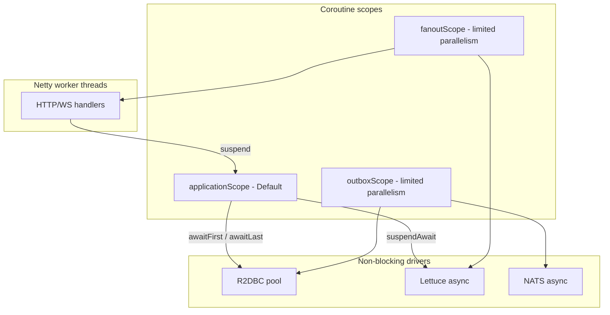
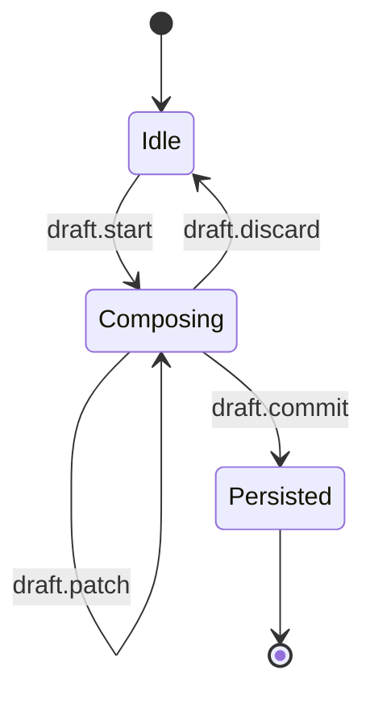
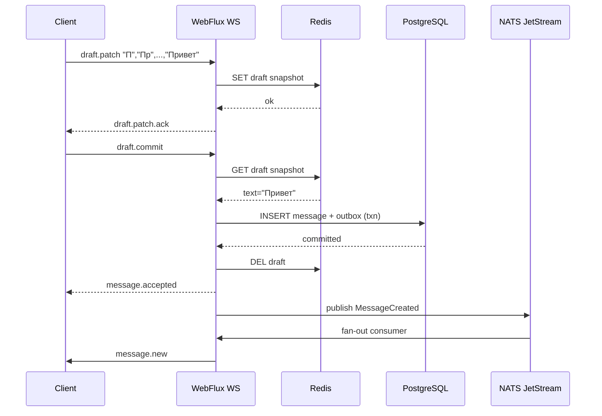
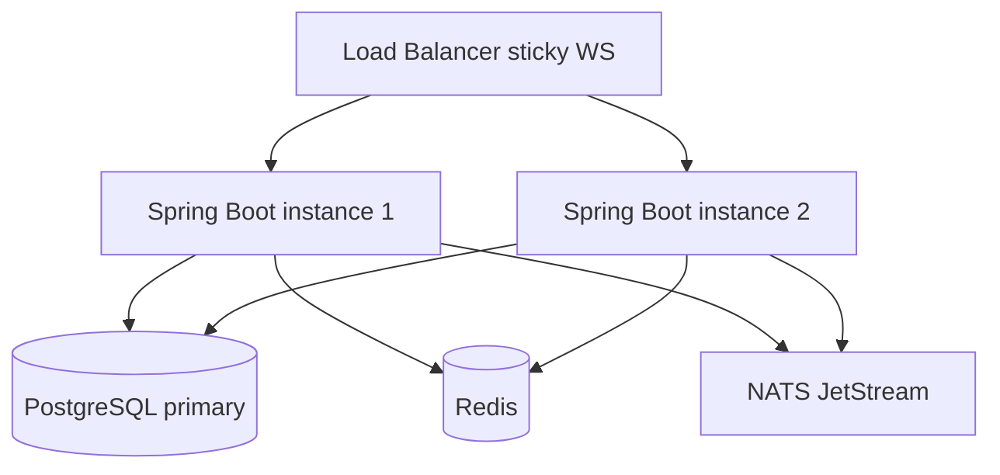

# Архитектура бэкенда приватного мессенджера

> Статус: план (реализация не начата). Июнь 2026.

## Чеклист

- [ ] Gradle + Spring Boot 4.0.6
- [ ] README + ручной setup инфраструктуры
- [ ] Flyway миграции (отдельная Gradle task)
- [ ] Auth JWT
- [ ] Draft-sync + WebSocket
- [ ] Outbox → NATS → fan-out
- [ ] Load test 2k TPS

---

## Цели и ограничения


| Параметр     | Значение                                                                                           |
| ------------ | -------------------------------------------------------------------------------------------------- |
| Нагрузка     | ~2 000 TPS на запись сообщений (пик)                                                               |
| Пользователи | тысячи, не миллионы                                                                                |
| MVP          | только текстовые сообщения                                                                         |
| Язык         | Kotlin                                                                                             |
| Деплой       | JVM локально; **без Docker** в репозитории                                                         |
| Документация | README (setup) + KDoc в коде + ARCHITECTURE.md                                                     |
| I/O модель   | **100% неблокирующий реактивный стек** — без JDBC, без blocking Redis, без `runBlocking` в runtime |


При 2 000 TPS ключ — **Reactor Netty + WebFlux**: I/O через `Mono`/`Flux` или `suspend`-контроллеры; fan-out в отдельном coroutine scope / `@Scheduled`.

---

## Стек (зафиксирован: Spring Boot 4 WebFlux)

Единый фреймворк: Spring Framework **7**, Reactor Netty, Kotlin **2.4** как first-class baseline (Boot 4 требует Kotlin 2.2+).

### Почему Boot 4, а не 3.5

| Фактор | Boot 3.5.14 | Boot 4.0.6 |
|--------|-------------|------------|
| OSS support | заканчивается **30 июня 2026** | актуальная ветка (GA с ноября 2025) |
| Greenfield | пришлось бы мигрировать через месяц | сразу на целевой платформе |
| Kotlin | работает, но baseline старее | **Kotlin 2.2+** официально, JSpecify null-safety |
| Spring | Framework 6.2 | Framework **7**, Spring Data **4**, Security **7** |
| Риск | меньше сюрпризов в туториалах | больше новизны, меньше Stack Overflow |

Для **нового** проекта в июне 2026 Boot 4 — правильный выбор: нет legacy, нет миграции 3→4.

| Слой | Библиотека |
|------|------------|
| Runtime | `spring-boot-starter-webflux` (Reactor Netty) |
| WebSocket | `WebSocketHandler` + `SimpleUrlHandlerMapping` |
| Auth | `spring-boot-starter-security` + reactive JWT `WebFilter` |
| PostgreSQL | `spring-boot-starter-data-r2dbc` — **без JDBC** в runtime |
| Redis | `spring-boot-starter-data-redis-reactive` (Lettuce) |
| Очередь | `io.nats:jnats` (JetStream) — вручную |
| JSON | `jackson-module-kotlin` |
| Корутины | `kotlinx-coroutines-reactor` + `suspend` в `@RestController` |
| Health / metrics | `spring-boot-starter-actuator` |
| Миграции | Flyway Gradle plugin; `spring.flyway.enabled=false` |

**Запрещено в runtime:** `spring-boot-starter-jdbc`, `spring-boot-starter-data-jpa`, Jedis sync, `runBlocking`, `Mono.block()`, Flyway auto-run.

Пакеты в `server`: `api` / `application` / `domain` / `infrastructure`.

---

## Версии библиотек и инфраструктуры (зафиксировано на июнь 2026)

### Runtime / toolchain

| Компонент | Версия | Примечание |
|-----------|--------|------------|
| **JDK** | **21** (LTS) | `java.toolchain` |
| **Gradle** | **8.14.5** | wrapper |
| **Kotlin** | **2.4.0** | + `kotlin-spring`, `kotlin-allopen` plugins |
| **Spring Boot BOM** | **4.0.6** | Spring Framework **7.0.x**, Spring Data **4.x**, Security **7.x** |

Boot **4.0.6** (апрель 2026) — последний stable patch 4.0.x с security fixes (в т.ч. DevTools CVE). Следить за 4.1.x при выходе.

### Spring Boot starters (версии из BOM `4.0.6`)

| Starter | Назначение |
|---------|------------|
| `spring-boot-starter-webflux` | HTTP, WebSocket, Reactor Netty |
| `spring-boot-starter-data-r2dbc` | R2DBC + `DatabaseClient` + транзакции |
| `spring-boot-starter-data-redis-reactive` | `ReactiveRedisTemplate`, Lettuce |
| `spring-boot-starter-security` | reactive Security, JWT filter |
| `spring-boot-starter-actuator` | `/actuator/health`, metrics |
| `spring-boot-starter-validation` | Jakarta Validation |

### Kotlin / JSON

| Библиотека | Версия | Артефакт |
|------------|--------|----------|
| Coroutines | **1.11.0** | `kotlinx-coroutines-core` |
| Coroutines Reactor | **1.11.0** | `kotlinx-coroutines-reactor` |
| Jackson Kotlin | из BOM | `jackson-module-kotlin` |

### Данные и messaging (явные версии, если override BOM)

| Библиотека | Версия | Примечание |
|------------|--------|------------|
| R2DBC PostgreSQL | **1.0.9.RELEASE** | управляется Boot BOM; override при необходимости |
| NATS Java | **2.25.3** | `io.nats:jnats` — вне BOM |
| BCrypt | из Security | `BCryptPasswordEncoder` — только на register/login, `withContext(Default)` |

### Миграции (вне runtime, Gradle task)


| Библиотека           | Версия      | Артефакт                                                            |
| -------------------- | ----------- | ------------------------------------------------------------------- |
| Flyway Core          | **11.20.3** | `org.flywaydb:flyway-core`                                          |
| Flyway PostgreSQL    | **11.20.3** | `org.flywaydb:flyway-database-postgresql`                           |
| Flyway Gradle Plugin | **11.20.3** | `org.flywaydb:flyway-gradle-plugin`                                 |
| PostgreSQL JDBC      | **42.7.5**  | `org.postgresql:postgresql` — **только для Flyway**, не для runtime |


### Утилиты

| Библиотека | Версия | Артефакт |
|------------|--------|----------|
| UUID v7 | **5.1.0** | `com.fasterxml.uuid:java-uuid-generator` |

Пароли: `BCryptPasswordEncoder` из Spring Security (не jbcrypt).


### Логирование


| Библиотека               | Версия           |
| ------------------------ | ---------------- |
| SLF4J API                | **2.0.17**       |
| Logback Classic          | **1.5.18**       |
| logstash-logback-encoder | **8.1** (фаза 3) |


### Тесты


| Библиотека                | Версия                   |
| ------------------------- | ------------------------ |
| JUnit Jupiter             | **5.12.2**               |
| kotlinx-coroutines-test   | **1.11.0**               |
| Testcontainers PostgreSQL | **1.21.0** (опционально) |
| ArchUnit                  | **1.4.1**                |
| detekt                    | **1.23.8**               |


### Документация и метрики


| Библиотека            | Версия              |
| --------------------- | ------------------- |
| Dokka                 | **2.0.0**           |
| Micrometer Core       | **1.15.0** (фаза 3) |
| Micrometer Prometheus | **1.15.0** (фаза 3) |


### Внешние сервисы (устанавливаются вручную, см. README)


| Сервис      | Минимальная версия         |
| ----------- | -------------------------- |
| PostgreSQL  | **16**                     |
| Redis       | **7.2**                    |
| NATS Server | **2.10** (JetStream `-js`) |


### `gradle/libs.versions.toml` (version catalog)

```toml
[versions]
kotlin = "2.4.0"
spring-boot = "4.0.6"
coroutines = "1.11.0"
jnats = "2.25.3"
flyway = "11.20.3"
postgresql-jdbc = "42.7.5"   # только flywayMigrate
uuid = "5.1.0"
archunit = "1.4.1"
detekt = "1.23.8"
dokka = "2.0.0"

[libraries]
spring-boot-bom = { module = "org.springframework.boot:spring-boot-dependencies", version.ref = "spring-boot" }
kotlinx-coroutines-core = { module = "org.jetbrains.kotlinx:kotlinx-coroutines-core", version.ref = "coroutines" }
kotlinx-coroutines-reactor = { module = "org.jetbrains.kotlinx:kotlinx-coroutines-reactor", version.ref = "coroutines" }
jnats = { module = "io.nats:jnats", version.ref = "jnats" }
flyway-core = { module = "org.flywaydb:flyway-core", version.ref = "flyway" }
flyway-postgresql = { module = "org.flywaydb:flyway-database-postgresql", version.ref = "flyway" }
postgresql-jdbc = { module = "org.postgresql:postgresql", version.ref = "postgresql-jdbc" }
uuid-generator = { module = "com.fasterxml.uuid:java-uuid-generator", version.ref = "uuid" }

[plugins]
kotlin-jvm = { id = "org.jetbrains.kotlin.jvm", version.ref = "kotlin" }
kotlin-spring = { id = "org.jetbrains.kotlin.plugin.spring", version.ref = "kotlin" }
spring-boot = { id = "org.springframework.boot", version.ref = "spring-boot" }
detekt = { id = "io.gitlab.arturbosch.detekt", version.ref = "detekt" }
dokka = { id = "org.jetbrains.dokka", version.ref = "dokka" }
flyway = { id = "org.flywaydb.flyway", version.ref = "flyway" }
```

В `server/build.gradle.kts`:

```kotlin
plugins {
    alias(libs.plugins.kotlin.jvm)
    alias(libs.plugins.kotlin.spring)
    alias(libs.plugins.spring.boot)
    alias(libs.plugins.detekt)
    alias(libs.plugins.dokka)
}

dependencies {
    implementation(platform(libs.spring.boot.bom))
    implementation("org.springframework.boot:spring-boot-starter-webflux")
    implementation("org.springframework.boot:spring-boot-starter-data-r2dbc")
    implementation("org.springframework.boot:spring-boot-starter-data-redis-reactive")
    implementation("org.springframework.boot:spring-boot-starter-security")
    implementation("org.springframework.boot:spring-boot-starter-actuator")
    implementation("org.springframework.boot:spring-boot-starter-validation")
    implementation("com.fasterxml.jackson.module:jackson-module-kotlin")
    implementation(libs.kotlinx.coroutines.reactor)
    implementation(libs.jnats)
    testImplementation("org.springframework.boot:spring-boot-starter-test")
    testImplementation("io.projectreactor:reactor-test")
}

java { toolchain { languageVersion.set(JavaLanguageVersion.of(21)) } }
```

`application.yml`: `spring.flyway.enabled: false` — миграции только через `./gradlew flywayMigrate`.

Политика обновлений: patch Boot 4.0.x / Kotlin — свободно; minor Boot 4.1+ — после чтения release notes.

**Boot 4 нюансы для проекта:** Jackson 3 namespace (управляется BOM); `spring.flyway.enabled=false` как и раньше; тесты — явно подключать `spring-boot-starter-webflux-test` при необходимости WebTestClient.

---

## Реактивная модель: неблокирующий I/O + многопоточность

Принцип: **корутина suspend'ится, поток освобождается**. Reactive-драйвер (R2DBC, Lettuce, NATS) завершает I/O на своих Netty/reactor-потоках и resume'ит корутину. Потоки не блокируются в ожидании сети или диска.




### Dispatchers и scope'ы


| Компонент                  | Dispatcher / scope                                                                          | Назначение                                                              |
| -------------------------- | ------------------------------------------------------------------------------------------- | ----------------------------------------------------------------------- |
| HTTP/WS handlers           | Reactor Netty event-loop                                                                    | `@RestController`, `WebSocketHandler`                                   |
| Валидация, mapping, bcrypt | `Dispatchers.Default`                                                                       | CPU-bound, короткие задачи                                              |
| R2DBC / Redis / NATS       | **не нужен Dispatchers.IO**                                                                 | `suspend` через `awaitFirst()`, `suspendAwait()` — поток не блокируется |
| Outbox publisher           | `CoroutineScope(SupervisorJob() + Executors.newFixedThreadPool(2).asCoroutineDispatcher())` | фоновый poll outbox, не event-loop                                      |
| WS fan-out                 | отдельный scope, parallelism = CPU                                                          | push в сессии, не блокирует commit                                      |


`Dispatchers.IO` — **не используем** для БД/Redis: это пул для legacy blocking API. Весь I/O — через reactive suspend.

### Паттерн репозитория (Spring Data R2DBC)

```kotlin
// infrastructure — CoroutineCrudRepository или DatabaseClient
interface MessageRepository : CoroutineCrudRepository<MessageEntity, UUID>

// либо DatabaseClient + suspend
suspend fun insert(message: Message): Message =
    databaseClient.sql("INSERT INTO messages ...")
        .bind(...)
        .fetch()
        .awaitOne()  // kotlinx-coroutines-reactor
```

Транзакция (message + outbox): `@Transactional` на suspend-сервисе + `TransactionalOperator`.

### Паттерн Redis (Spring Data Redis Reactive)

```kotlin
suspend fun setDraft(key: String, json: String, ttl: Duration) {
    reactiveRedisTemplate.opsForValue()
        .set(key, json, ttl)
        .awaitFirst()
}
```

Только `ReactiveRedisTemplate` / `ReactiveStringRedisTemplate`, **не** `RedisTemplate` (blocking).

### Паттерн NATS

```kotlin
suspend fun publish(subject: String, payload: ByteArray) {
    jetStream.publishAsync(subject, payload).await()
}
```

### Фоновые циклы (outbox publisher)

```kotlin
// Отдельный scope, не runBlocking
outboxScope.launch {
    while (isActive) {
        val batch = outboxRepository.claimBatch(limit = 100) // suspend R2DBC
        if (batch.isEmpty()) delay(50) else batch.forEach { publish(it) }
    }
}
```

`delay()` — cooperative, не блокирует поток.

### Контроль на уровне сборки

- **ArchUnit** или **detekt** custom rule: запрет `runBlocking`, `java.sql`, `jedis`, `Mono.block` в `server/src/main`.
- KDoc на `infrastructure`-адаптерах: «non-blocking, suspend only».

### GraalVM Native Image

- **Не на старте.** Reflection, Netty, R2DBC — требуют `native-image` конфигурации.
- **План:** JVM локально → Spring Native / GraalVM после фиксации API (фаза 4).
- Выигрыш при 2k TPS умеренный (память, cold start); главная ценность — компактные sidecar-сервисы (push-worker, outbox-publisher).

---

## Модульная структура проекта

```
private-chat/
├── README.md                 # что установить и как запустить (без Docker)
├── ARCHITECTURE.md           # обзор слоёв, ссылки на KDoc
├── settings.gradle.kts
├── build.gradle.kts
├── server/                   # единственный модуль на старте
│   └── src/main/
│       ├── kotlin/.../
│       │   ├── api/          # @RestController, WebSocketHandler, DTO
│       │   ├── application/  # @Service use-cases
│       │   ├── domain/       # модели, порты
│       │   ├── infrastructure/ # R2dbcRepository, Redis, NATS
│       │   └── config/       # Security, R2DBC, Redis, WebSocket beans
│       └── resources/
│           ├── application.yml   # Spring config, env placeholders
│           └── db/migration/     # SQL для flywayMigrate
└── .env.example              # шаблон переменных (без секретов)
```

**MVP:** monolith `server` с пакетами `api / application / domain / infrastructure`. **Docker-файлы и docker-compose в репозиторий не добавляем** — инфраструктуру поднимаете сами, README описывает шаги.

---

## API: примеры URL

Базовый префикс: `/api/v1`. Аутентификация: `Authorization: Bearer <JWT>`.

### Auth


| Метод  | URL                     | Описание                |
| ------ | ----------------------- | ----------------------- |
| `POST` | `/api/v1/auth/register` | регистрация             |
| `POST` | `/api/v1/auth/login`    | access + refresh token  |
| `POST` | `/api/v1/auth/refresh`  | обновление access token |


### Пользователи и чаты


| Метод  | URL                              | Описание                                           |
| ------ | -------------------------------- | -------------------------------------------------- |
| `GET`  | `/api/v1/users/me`               | текущий пользователь                               |
| `GET`  | `/api/v1/users?q=alice`          | поиск (приватный мессенджер — по invite/allowlist) |
| `POST` | `/api/v1/chats`                  | создать direct/group чат                           |
| `GET`  | `/api/v1/chats`                  | список чатов (cursor pagination)                   |
| `GET`  | `/api/v1/chats/{chatId}`         | метаданные чата                                    |
| `POST` | `/api/v1/chats/{chatId}/members` | добавить участника (group)                         |


### Черновики (draft) — REST fallback


| Метод    | URL                                              | Описание                                  |
| -------- | ------------------------------------------------ | ----------------------------------------- |
| `POST`   | `/api/v1/chats/{chatId}/drafts`                  | создать черновик, вернуть `draftId`       |
| `PUT`    | `/api/v1/chats/{chatId}/drafts/{draftId}`        | upsert снимка текста (`revision`, `text`) |
| `GET`    | `/api/v1/chats/{chatId}/drafts/{draftId}`        | восстановить черновик (смена устройства)  |
| `POST`   | `/api/v1/chats/{chatId}/drafts/{draftId}/commit` | **отправить** — persist из Redis-снимка   |
| `DELETE` | `/api/v1/chats/{chatId}/drafts/{draftId}`        | отменить черновик                         |


Основной путь — **WebSocket** (ниже); REST — для reconnect и клиентов без WS.

### Сообщения (текст)


| Метод    | URL                                                        | Описание                                    |
| -------- | ---------------------------------------------------------- | ------------------------------------------- |
| `POST`   | `/api/v1/chats/{chatId}/messages`                          | прямая отправка без draft (fallback / боты) |
| `GET`    | `/api/v1/chats/{chatId}/messages?before={cursor}&limit=50` | история (keyset pagination)                 |
| `GET`    | `/api/v1/chats/{chatId}/messages/{messageId}`              | одно сообщение                              |
| `PATCH`  | `/api/v1/chats/{chatId}/messages/{messageId}`              | редактирование (опционально)                |
| `DELETE` | `/api/v1/chats/{chatId}/messages/{messageId}`              | удаление (tombstone)                        |


### Real-time (WebSocket)


| Тип       | URL / frame              | Описание                                    |
| --------- | ------------------------ | ------------------------------------------- |
| WebSocket | `/api/v1/ws?token=<JWT>` | draft-sync, доставка, ack                   |
| frame →   | `draft.start`            | начать черновик в чате                      |
| frame →   | `draft.patch`            | обновить снимок (после debounce на клиенте) |
| frame →   | `draft.commit`           | зафиксировать и отправить сообщение         |
| frame →   | `draft.discard`          | удалить черновик                            |
| frame ←   | `draft.patch.ack`        | подтверждение revision                      |
| frame ←   | `message.new`            | доставка готового сообщения                 |
| `POST`    | `/api/v1/ws/ack`         | REST-fallback для ack доставки              |


### Пример тела запроса/ответа

`**POST /api/v1/chats/{chatId}/messages`**

```json
{
  "clientMessageId": "550e8400-e29b-41d4-a716-446655440000",
  "text": "Привет!",
  "replyTo": null
}
```

**Ответ `202 Accepted`** (реактивный write — не ждём fan-out):

```json
{
  "id": "msg_01HXYZ...",
  "chatId": "...",
  "clientMessageId": "550e8400-...",
  "status": "accepted",
  "createdAt": "2026-06-10T12:00:00Z"
}
```

**WebSocket event `message.new`:**

```json
{
  "type": "message.new",
  "payload": {
    "id": "msg_01HXYZ...",
    "chatId": "...",
    "senderId": "...",
    "text": "Привет!",
    "createdAt": "2026-06-10T12:00:00Z"
  }
}
```

`clientMessageId` — идемпотентность: повтор commit с тем же ID возвращает тот же `id`, без дубликата.

---

## Draft-sync: посимвольный ввод → снимок на сервере → commit

Идея: клиент **стримит состояние черновика** на бэкенд по мере набора; при нажатии «Отправить» сервер **не ждёт полного текста в теле запроса** — он уже хранит актуальный снимок и только **персистит и fan-out'ит**.

### Важные ограничения

- **Черновик приватен (зафиксировано):** текст видят только автор и сервер. Другим участникам — максимум `typing.indicator` (boolean, без текста). Live preview черновика **не** реализуем.
- **Клиент debounce обязателен:** 50–150 ms между `draft.patch`, иначе Redis получит десятки тысяч ops/s.
- **Черновик эфемерен:** только Redis, TTL 30 min (продлевается при patch). В PostgreSQL попадает только после `commit`.
- **Источник истины при commit — серверный снимок** в Redis, не тело `draft.commit` (тело опционально для fallback).

### Жизненный цикл




### Протокол WebSocket (основной)

**1. Начало набора** — `draft.start`

```json
{
  "type": "draft.start",
  "payload": {
    "chatId": "...",
    "draftId": "550e8400-e29b-41d4-a716-446655440000",
    "clientSessionId": "device-abc"
  }
}
```

Сервер: `SET draft:{userId}:{chatId}` → пустой `{ text: "", revision: 0 }`, TTL 30m. Ответ `draft.started`.

**2. Каждое обновление (после debounce)** — `draft.patch`

Два варианта; для MVP рекомендуем **full snapshot** (проще, достаточно для текста до 4–8 KB):

```json
{
  "type": "draft.patch",
  "payload": {
    "draftId": "550e8400-...",
    "chatId": "...",
    "revision": 7,
    "text": "Привет"
  }
}
```

Альтернатива для длинных сообщений — **delta**:

```json
{
  "type": "draft.patch",
  "payload": {
    "draftId": "...",
    "revision": 7,
    "ops": [{ "op": "insert", "at": 6, "text": "!" }]
  }
}
```

Сервер:

1. Проверить membership (Redis cache).
2. Если `revision <= stored.revision` → игнор (идемпотентность) или `draft.patch.ack` с текущим revision.
3. Применить patch → обновить Redis HASH/JSON.
4. Ответ `draft.patch.ack { revision: 7, serverTime }`.
5. Опционально: `typing.indicator` другим участникам чата (без текста).

**3. Отправка** — `draft.commit`

```json
{
  "type": "draft.commit",
  "payload": {
    "draftId": "550e8400-...",
    "chatId": "...",
    "clientMessageId": "660e8400-...",
    "expectedRevision": 7
  }
}
```

Сервер:

1. `GET draft:{userId}:{chatId}` — взять снимок `"Привет"`.
2. Валидация: не пусто, длина, rate limit **commit** (отдельный от patch).
3. Если `expectedRevision != stored.revision` → `409 Conflict` + текущий снимок (клиент re-sync).
4. Транзакция PG: `INSERT message` + `outbox`; `DEL` draft в Redis.
5. Ответ `message.accepted` (аналог 202) + async `message.new` подписчикам.

**Пример: пользователь печатает «Привет»**


| Действие клиента | revision | text в Redis                 |
| ---------------- | -------- | ---------------------------- |
| `д`              | 1        | `П`                          |
| `р`              | 2        | `Пр`                         |
| ...              | ...      | ...                          |
| `т`              | 6        | `Привет`                     |
| **Отправить**    | commit   | → PG + fan-out, Redis очищен |


При commit тело сообщения **не передаётся** — сервер читает `"Привет"` из Redis.

### Хранение в Redis

```
Key:   draft:{userId}:{chatId}
Value: {"draftId":"...","text":"Привет","revision":6,"updatedAt":"...","clientSessionId":"..."}
TTL:   1800s (refresh on patch)
```

Индекс для восстановления: `draft:by-id:{draftId}` → `{userId, chatId}` (тот же TTL).

Операции — **один round-trip** (`SET` + `EXPIRE` или `SETEX`). При 2k commit TPS и ~10 patch/s на активного пользователя Redis легко выдерживает.

### Rate limits (раздельные)


| Операция                | Лимит                      | Хранение             |
| ----------------------- | -------------------------- | -------------------- |
| `draft.patch`           | 20/s на `(userId, chatId)` | Redis sliding window |
| `draft.commit`          | 30/min на `userId`         | Redis                |
| `message` (прямой POST) | 30/min на `userId`         | Redis                |


Patch-лимит защищает от buggy-клиента без debounce.

### Edge cases


| Ситуация                                 | Поведение                                                                  |
| ---------------------------------------- | -------------------------------------------------------------------------- |
| Draft истёк в Redis                      | `commit` → `410 Gone`; клиент шлёт `draft.patch` с полным текстом + commit |
| Два устройства, один draftId             | last-write-wins по `revision`; commit с устаревшим revision → 409          |
| Пустой commit                            | `400 Bad Request`, draft не удаляется                                      |
| Повтор commit (тот же `clientMessageId`) | идемпотентный ответ с тем же `messageId`                                   |
| WS оборвался                             | `GET /drafts/{draftId}` + `PUT` восстановление, затем commit               |


### Spring WebFlux: псевдокод draft WebSocket

```kotlin
@Component
class DraftWebSocketHandler(
    private val draftService: DraftService,
    private val messageCommandService: MessageCommandService
) : WebSocketHandler {

    override fun handle(session: WebSocketSession): Mono<Void> =
        session.receive()
            .flatMap { msg ->
                when (val frame = parseFrame(msg)) {
                    is DraftPatch -> draftService.applyPatch(session.userId, frame)
                        .then(send(session, DraftPatchAck(frame.revision)))
                    is DraftCommit -> mono {
                        val snapshot = draftService.getSnapshot(session.userId, frame.chatId)
                            ?: return@mono send(session, DraftGone())
                        val message = messageCommandService.commitFromDraft(snapshot, frame.clientMessageId)
                        send(session, MessageAccepted(message))
                    }
                    else -> Mono.empty()
                }
            }
            .then()
}
```

Альтернатива: `coRouter { GET("/api/v1/ws").and(accept(TEXT_EVENT_STREAM)) { ... } }` + suspend handler.

---

## Реактивный write-path (ядро дизайна)

Принцип: **HTTP отвечает быстро**, тяжёлая работа — асинхронно, **at-least-once** с идемпотентностью.




### Шаги write-path (commit)

1. **Валидация** (suspend, Redis cache membership): пользователь в чате, снимок не пуст, rate limit commit.
2. **Транзакция PostgreSQL:**
  - `INSERT INTO messages (...)`
  - `INSERT INTO outbox (event_type, payload, created_at)` — transactional outbox
  - уникальный индекс `(chat_id, client_message_id)` для идемпотентности
3. **Ответ 202** сразу после commit.
4. **Outbox publisher** (фоновая корутина / отдельный процесс): читает outbox → публикует в **NATS JetStream** (или Redis Streams для MVP).
5. **WS consumers** подписаны на subject `chat.{chatId}.events` → push онлайн-участникам.
6. **Offline:** сообщение уже в PG; при подключении клиент делает `GET /messages?after=cursor`.

### Почему не «чистый» fire-and-forget без outbox

При падении между INSERT и publish сообщение есть в БД, но не доставлено в real-time. **Transactional outbox** устраняет рассинхрон без двухфазного commit.

### Rate limiting

- Redis: `INCR` + TTL per `(userId, window)` — 30 msg/min на пользователя (настраиваемо).
- Возврат `429 Too Many Requests` с `Retry-After`.

---

## Варианты баз данных

### Рекомендация для MVP (~2k TPS, текст)


| Роль                                   | Решение                                            | Почему                                                                                                      |
| -------------------------------------- | -------------------------------------------------- | ----------------------------------------------------------------------------------------------------------- |
| **Метаданные** (users, chats, members) | **PostgreSQL 16**                                  | ACID, JOIN, миграции, знакомый стек                                                                         |
| **Сообщения**                          | **PostgreSQL** (та же БД, отдельная схема/таблица) | 2k TPS — ~170M сообщений/сутки теоретически; с партиционированием по `chat_id` или по месяцу хватит надолго |
| **Кэш / presence**                     | **Redis 7**                                        | online sessions, rate limit, pub/sub для WS hub                                                             |
| **Очередь событий**                    | **NATS JetStream**                                 | легче Kafka, персистентность, consumer groups                                                               |


**Схема сообщений (PostgreSQL):**

```sql
CREATE TABLE messages (
    id            UUID PRIMARY KEY,
    chat_id       UUID NOT NULL,
    sender_id     UUID NOT NULL,
    client_msg_id UUID NOT NULL,
    body          TEXT NOT NULL,
    created_at    TIMESTAMPTZ NOT NULL DEFAULT now(),
    deleted_at    TIMESTAMPTZ,
    UNIQUE (chat_id, client_msg_id)
) PARTITION BY RANGE (created_at);
```

Индексы: `(chat_id, created_at DESC)` для истории; BRIN на `created_at` для партиций.

### Альтернативы (когда перерастёте MVP)


| Сценарий                          | Вариант                                                          |
| --------------------------------- | ---------------------------------------------------------------- |
| Рост до 50k+ TPS, длинная история | **ScyllaDB** / **Cassandra** для messages (write-optimized, TTL) |
| Уже есть Kafka в инфраструктуре   | Kafka вместо NATS; outbox → Debezium CDC                         |
| Минимум инфраструктуры            | Redis Streams вместо NATS (проще, но слабее гарантии при сбоях)  |
| Полнотекстовый поиск              | **PostgreSQL tsvector** или отдельно **Meilisearch** (позже)     |
| Read replicas                     | PG replica для `GET /messages`, primary для write                |


**Не рекомендую на старте:** MongoDB (для чата нет выигрыша над PG при 2k TPS), отдельный Kafka-кластер (overkill).

---

## Ключевые технические решения в Spring WebFlux

```kotlin
@RestController
@RequestMapping("/api/v1/chats/{chatId}")
class DraftController(private val messageCommandService: MessageCommandService) {

    @PostMapping("/drafts/{draftId}/commit")
    suspend fun commitDraft(
        @AuthenticationPrincipal user: UserPrincipal,
        @PathVariable chatId: UUID,
        @RequestBody req: CommitDraftRequest
    ): ResponseEntity<MessageAcceptedDto> {
        val snapshot = draftService.getSnapshot(user.id, chatId)
            ?: throw DraftNotFoundException()
        val message = messageCommandService.commitFromDraft(snapshot, req.clientMessageId)
        return ResponseEntity.accepted().body(message.toAcceptedDto())
    }
}
```

- **БД:** `spring-boot-starter-data-r2dbc` + `DatabaseClient` / `CoroutineCrudRepository`.
- **WebSocket:** `WebSocketHandler` + `WebSocketSessionManager` в Redis (pub/sub между инстансами).
- **Security:** `SecurityWebFilterChain` — JWT на REST и WS handshake (`?token=`).
- **JSON:** Jackson + `jackson-module-kotlin`.
- **ID:** UUID v7 — сортируемость для keyset pagination.

---

## Локальный запуск (README, без Docker)

В репозитории будет **README.md** с пошаговой инструкцией. Краткое содержание (то, что туда войдёт):

### Что установить на машине


| Компонент       | Версия            | Зачем                           |
| --------------- | ----------------- | ------------------------------- |
| **JDK**         | 21 (LTS)          | Spring Boot, Gradle toolchain   |
| **PostgreSQL**  | 16+               | users, chats, messages, outbox  |
| **Redis**       | 7+                | drafts, rate limit, WS sessions |
| **NATS Server** | 2.10+ с JetStream | outbox → fan-out                |


Примеры установки в README — через пакетный менеджер ОС (`apt`, `brew`) или официальные бинарники; **без** `docker run`.

### Подготовка сервисов (ручная)

**PostgreSQL:**

```sql
CREATE USER private_chat WITH PASSWORD 'your_password';
CREATE DATABASE private_chat OWNER private_chat;
```

**NATS** — включить JetStream в конфиге (`jetstream { store_dir: ... }`) или флагом `-js`.

**Redis** — достаточно дефолтного `redis-server` на `6379`.

### Переменные окружения (`.env.example`)

```bash
# Server
SERVER_PORT=8080

# PostgreSQL (R2DBC)
DB_HOST=localhost
DB_PORT=5432
DB_NAME=private_chat
DB_USER=private_chat
DB_PASSWORD=your_password

# Redis
REDIS_HOST=localhost
REDIS_PORT=6379

# NATS
NATS_URL=nats://localhost:4222

# JWT (сгенерировать свой секрет)
JWT_SECRET=change-me-to-random-256-bit-string
JWT_ACCESS_TTL_MINUTES=15
JWT_REFRESH_TTL_DAYS=7
```

Spring читает их через `application.yml`:

```yaml
server:
  port: ${SERVER_PORT:8080}

spring:
  flyway:
    enabled: false
  r2dbc:
    url: r2dbc:postgresql://${DB_HOST:localhost}:${DB_PORT:5432}/${DB_NAME:private_chat}
    username: ${DB_USER}
    password: ${DB_PASSWORD}
  data:
    redis:
      host: ${REDIS_HOST:localhost}
      port: ${REDIS_PORT:6379}

app:
  nats:
    url: ${NATS_URL:nats://localhost:4222}
  jwt:
    secret: ${JWT_SECRET}
```

### Запуск приложения

```bash
cp .env.example .env   # отредактировать
export $(grep -v '^#' .env | xargs)   # или через IDE Run Configuration

# 1. Миграции — отдельно (Flyway blocking, не в event-loop сервера)
./gradlew flywayMigrate

# 2. Сервер — WebFlux reactive runtime
./gradlew :server:bootRun
```

Health-check: `GET http://localhost:8080/actuator/health` (R2DBC, Redis, custom NATS indicator).

### README также включит

- Проверка зависимостей (`psql`, `redis-cli ping`, `nats server check`)
- Типичные ошибки (connection refused, JetStream disabled)
- Пример `curl` для register → login → create chat
- Ссылка на `ARCHITECTURE.md` и как сгенерировать HTML-доку из KDoc (`./gradlew dokkaHtml`)

---

## Документация в коде (KDoc)

Цель — **разобраться в коде без внешних wiki**. Правила для реализации:

### Где писать KDoc


| Слой              | Что документировать                                                                 |
| ----------------- | ----------------------------------------------------------------------------------- |
| `domain/`         | Каждая сущность (`Message`, `DraftSnapshot`), value-классы, интерфейсы репозиториев |
| `application/`    | Каждый use-case сервис: вход/выход, инварианты, идемпотентность                     |
| `api/`            | Route-группы (file-level KDoc), не каждый handler                                   |
| `infrastructure/` | Адаптеры (Redis, R2DBC): ключи Redis, формат JSON, subject NATS                     |


### Стиль KDoc (пример)

```kotlin
/**
 * Сервис черновиков сообщений.
 *
 * Хранит эфемерные снимки текста в Redis до [commitFromDraft].
 * Текст черновика приватен — другим участникам не отдаётся.
 *
 * Redis key: `draft:{userId}:{chatId}` — см. [DraftRedisKeys].
 *
 * @see DraftWebSocketHandler для протокола draft.patch / draft.commit
 */
class DraftService(...)
```

```kotlin
/**
 * Фиксирует сообщение из серверного снимка черновика.
 *
 * @param clientMessageId идемпотентный ключ; повторный вызов с тем же ID
 *   возвращает существующее сообщение без дубля в БД.
 * @return принятое сообщение со статусом [MessageStatus.ACCEPTED]
 * @throws DraftNotFoundException если TTL истёк или черновик удалён
 * @throws RevisionConflictException если [expectedRevision] не совпадает с Redis
 */
suspend fun commitFromDraft(...): Message
```

### Gradle: Dokka

В `build.gradle.kts` модуля `server`:

- плагин `org.jetbrains.dokka`
- `./gradlew :server:dokkaHtml` → `server/build/dokka/html/index.html`

### ARCHITECTURE.md

Короткий навигатор (1–2 экрана):

- диаграмма слоёв и поток draft → commit → outbox
- таблица пакетов с ссылками на главные классы
- глоссарий (`revision`, `clientMessageId`, `outbox`)

KDoc **не дублирует** README (нет инструкций по установке PostgreSQL в коде).

---

## Безопасность (минимум для приватного мессенджера)

- JWT (access 15m, refresh 7d), хранение refresh в PG с rotation.
- TLS на ingress (nginx/caddy).
- E2E шифрование — **вне scope MVP**; transport TLS + encryption at rest в PG.
- Private-by-design: регистрация по invite-коду или allowlist доменов.

---

## Деплой и масштабирование




- 2+ инстанса Spring Boot за LB; WebSocket — sticky sessions или Redis pub/sub bridge.
- Health: Spring Actuator `/actuator/health`.

---

## План реализации (порядок работ)

### Фаза 1 — скелет (1–2 недели)

- Gradle monolith, Spring Boot WebFlux, `application.yml` + `.env.example`
- **README.md** — ручная настройка JDK / PostgreSQL / Redis / NATS
- SQL-миграции + `flywayMigrate` (вне runtime); reactive infrastructure (R2DBC, Lettuce, NATS)
- ArchUnit/detekt: ban blocking API
- **KDoc** на domain + application; **ARCHITECTURE.md**
- Dokka в Gradle
- Auth JWT (register/login)
- `GET /messages`, прямой `POST /messages` (fallback)

### Фаза 2 — draft-sync + доставка

- WebSocket `/api/v1/ws`: `draft.start`, `draft.patch`, `draft.commit`
- Redis draft storage, revision, rate limits
- `commitFromDraft` → PG + outbox; outbox publisher → NATS
- События `message.new`, идемпотентность `clientMessageId`

### Фаза 3 — production hardening

- Метрики (Micrometer/Prometheus), structured logging
- Нагрузочный тест (k6/gatling) на 2k TPS write
- Read replica / connection pool tuning

### Фаза 4 — native (опционально)

- GraalVM build для `outbox-publisher` или всего API
- CI pipeline с `native-image`

---

## Итоговая рекомендация


| Компонент        | Выбор                                                                |
| ---------------- | -------------------------------------------------------------------- |
| Framework        | **Spring Boot 4.0 WebFlux** (SF 7)                                   |
| Concurrency      | **Coroutines + suspend**; R2DBC/Lettuce/NATS async; без blocking I/O |
| Messages DB      | **PostgreSQL** (партиции)                                            |
| Meta DB          | **PostgreSQL**                                                       |
| Cache / presence | **Redis**                                                            |
| Event bus        | **NATS JetStream**                                                   |
| Draft storage    | **Redis** (эфемерный снимок)                                         |
| API style        | WS draft-sync + commit `202` + `message.new` push                    |
| Native           | отложить до фазы 4                                                   |
| Infra in repo    | **нет Docker**; только README + `.env.example`                       |
| Docs             | README + KDoc + Dokka + ARCHITECTURE.md                              |


Начать с **Фазы 1**: scaffold Gradle/Spring Boot, README, миграции, KDoc; **Фаза 2** — draft-sync.